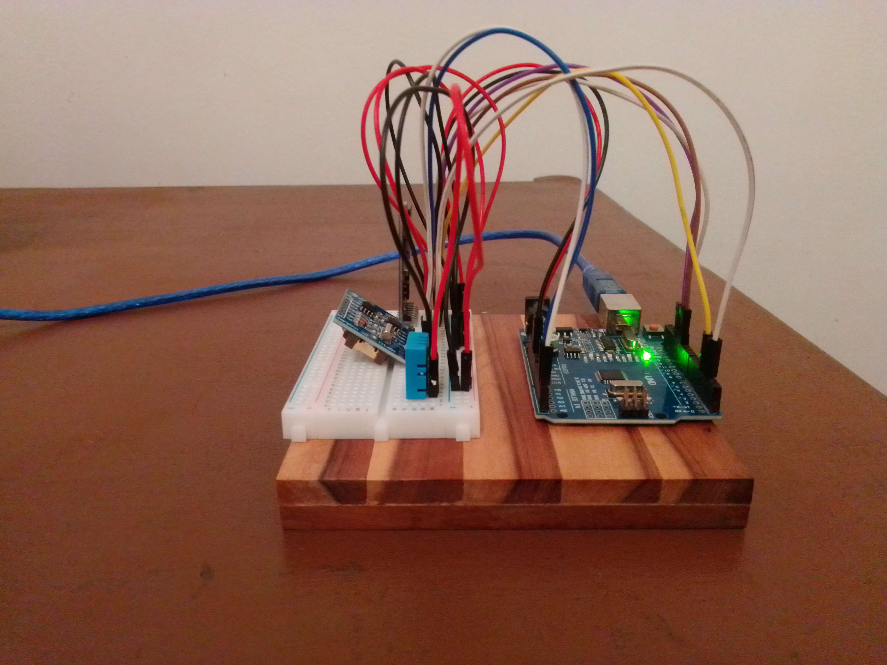
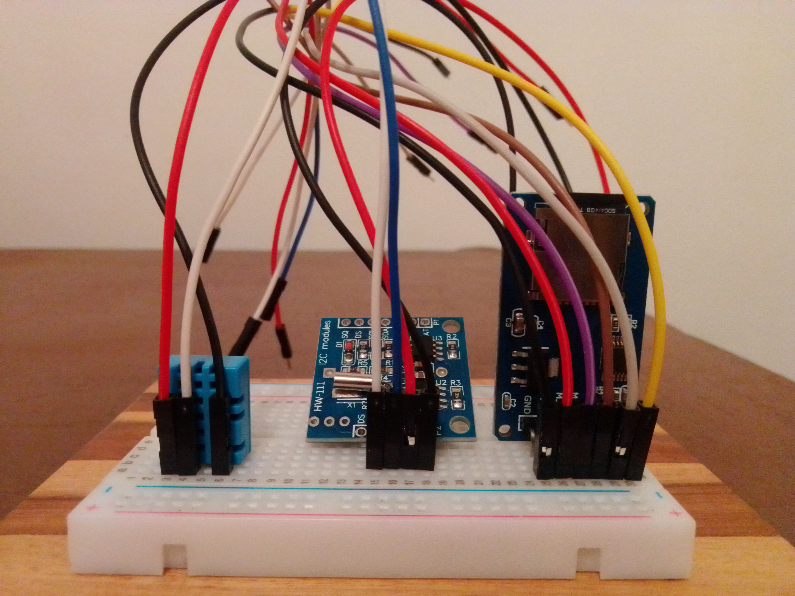

## DATALOOGER DE BAIXO CUSTO UTILIZANDO ARDUINO

### MATERIAS UTILIZADOS

+ Arduino Uno 
+ Sensor DHT11
+ Módulo Micro SD
+ Protoboard 400 pontos
+ Jumpers

### Imagens do Projeto

</img>
</img>
</img>

